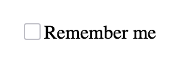
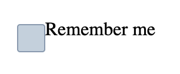

# CSS Cross Contamination example

In deze app wilden we laten zien waarom de className naar rhc-theme-methode die we gebruiken om het css cross contamination-probleem op te lossen,
niet goed werkt in componenten die zich in een andere component bevinden, zoals een checkbox.

In de code kun je dit zien als je regel 2 van `App.tsx` comment en weer uitcomment:

```javascript
// import { Checkbox as RhcCheckbox } from "@rijkshuisstijl-community/components-react";
```

In de voorbeeldapp gebruiken we een utrecht checkbox. Stel je voor, dat in deze app ook elders onze rhc checkbox wordt gebruikt met extra functionaliteit bovenop de utrecht checkbox. Beiden zullen dus moeten worden geïmporteerd. Het vervelende is echter, dat nu de css voor rhc checkbox óók op de utrecht checkbox wordt toegepast.

Als de import van regel 2 (zie hierboven) wordt uitgecomment krijg je de normale utrecht checkbox:

Maar als je die regel wel hebt, en dus css inlaadt waarvan we eigenlijk willen dat die alléén effect heeft op `<RhcCheckbox>` en niet op `<UtrechtCheckbox>`, krijg je dit:


We willen graag advies hoe dit het beste wordt vermeden. Dit moet toch al vaker zijn voorgekomen.
